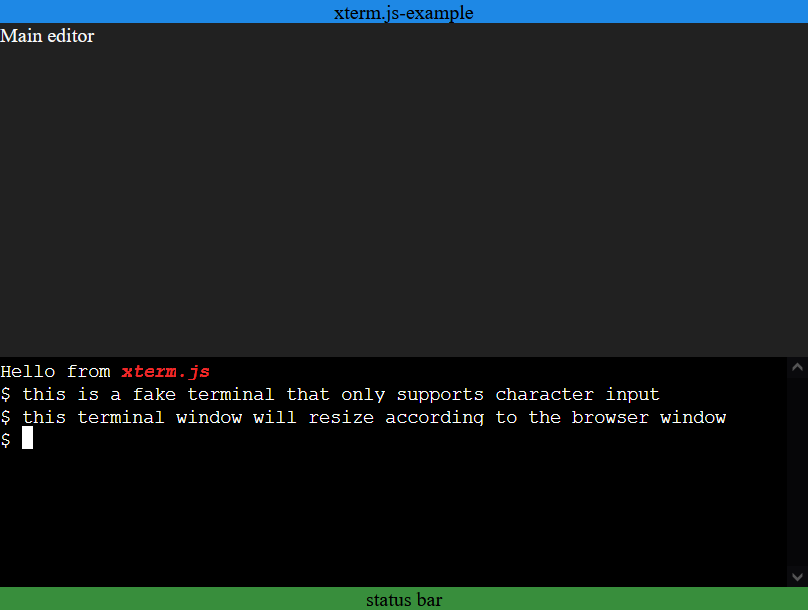

# xterm.js Embedded Example

A minimal example for demonstrating using [xterm.js](https://github.com/xtermjs/xterm.js/) in an embedded fashion. (support window resize)

Online Demo: https://j3soon.github.io/xterm.js-embedded-example/

## Screenshot

[](https://j3soon.github.io/xterm.js-embedded-example/)

## Set up

```sh
# Manual install
npm install xterm
npm install xterm-addon-fit
# Install according to package.json
npm install
```

## Run

Open [`index.html`](index.html) in your browser.
